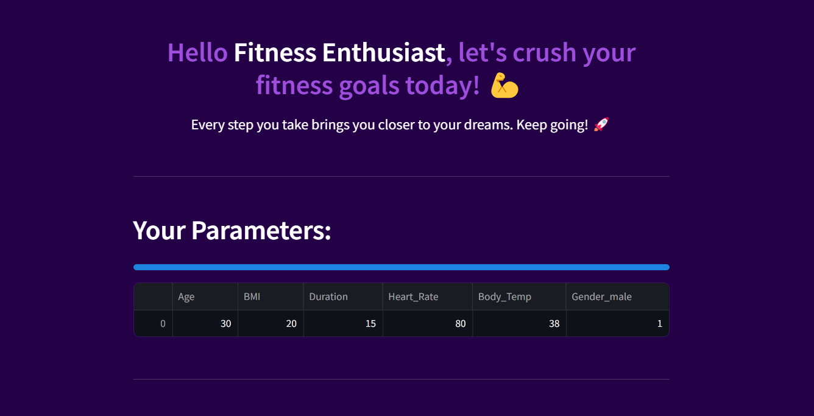
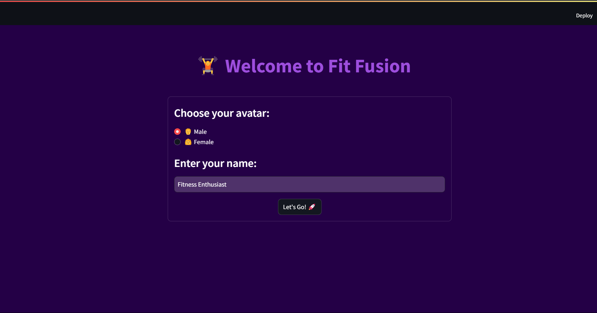
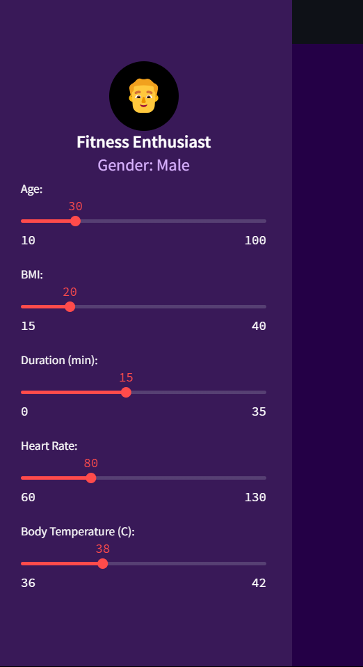
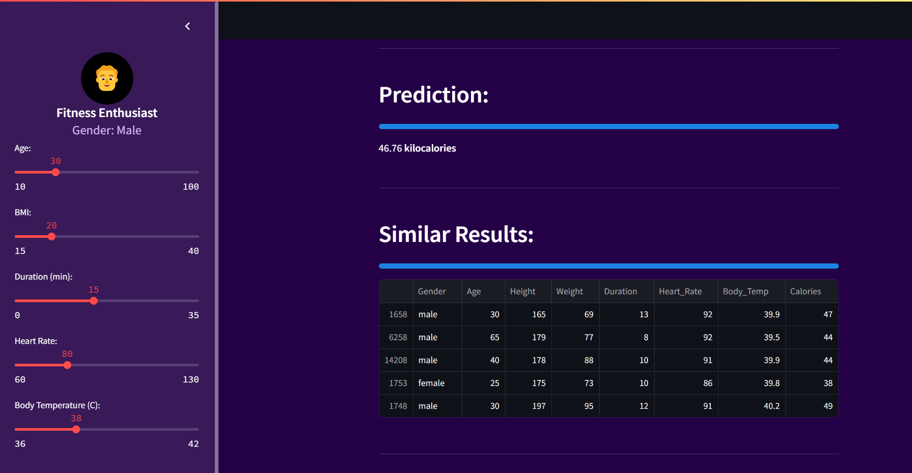
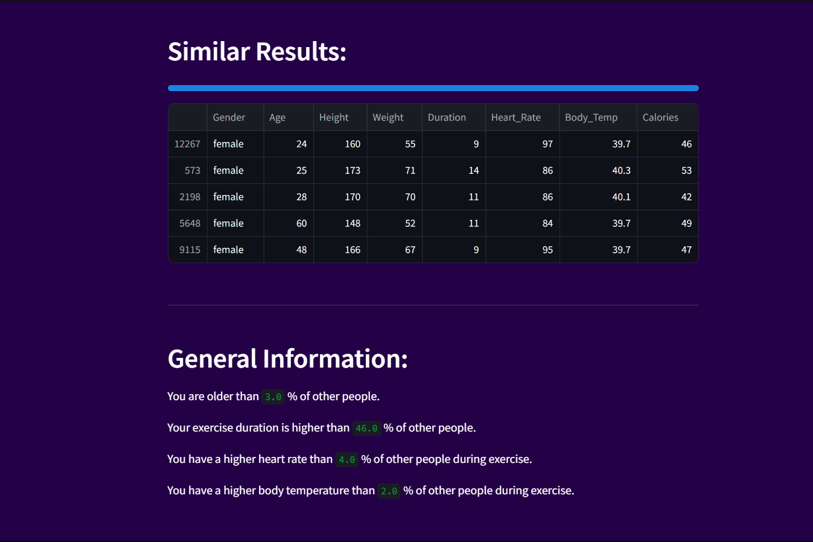

# Fit Fusion 🔥 - AI-Powered Calorie Expenditure Predictor

<table>
   <tr>
      <td>
<p align="center">
  
</p> </td>
      <td>
<p align="center">
  
</p>
      </td>
   </tr>
</table>


Predict calories burned during workouts using machine learning! Fit Fusion is an interactive web app that estimates calorie expenditure based on user inputs like age, BMI, heart rate, and exercise duration.

## 🌟 Features

- **Personalized avatar setup** with gender selection
- **Real-time calorie prediction** using Random Forest Regression
- **Interactive dashboard** with adjustable sliders
- **Comparative analytics** showing how you rank against others
- **Similar workout cases** from the dataset
- **Beautiful UI** with custom purple-dark theme

## 🛠️ Tech Stack

- **Frontend**: Streamlit
- **Backend**: Python
- **Machine Learning**: scikit-learn (Random Forest Regressor)
- **Data Processing**: pandas, numpy
- **Visualization**: Matplotlib, Seaborn *(planned expansion)*

## 📦 Installation

1. Clone the repository:
   ```bash
   git clone https://github.com/yourusername/fit-fusion.git
   cd fit-fusion

   Install dependencies:
# Personal Fitness Tracker  

## Install Dependencies  

```bash
pip install -r requirements.txt
```

## Download the Dataset Files  

Place **exercise.csv** and **calories.csv** in the project root.  

## Run the App  

```bash
streamlit run app.py
```

## 🚀 Usage  

### Set Up Your Profile  

- Choose an avatar (Male/Female)  
- Enter your name  

### Adjust Your Parameters Using the Sidebar Sliders  

- **Age**  
- **BMI**  
- **Exercise Duration**  
- **Heart Rate**  
- **Body Temperature**  

### View Your Results  

- **Personalized calorie prediction**  
- **How you compare to others**  
- **Similar workout cases**  

---

## 📊 Dataset  

The model is trained on a dataset containing:  

- **15,000** exercise records  
- **Features:** Gender, Age, Weight, Height, Duration, Heart Rate, Body Temp  
- **Target:** Calories burned  
- **Dataset Source:** [Kaggle Exercise Dataset](#)  

---

## 🤖 Machine Learning  

### **Algorithm:** Random Forest Regressor  

#### **Parameters:**  
- `n_estimators`: **1000**  
- `max_features`: **3**  
- `max_depth`: **6**  

#### **Performance:**  
- **MSE:** `2.34`  
- **R² Score:** `0.92`  

---

## 📝 Future Improvements  

- Integrate with **wearable devices** (Fitbit/Apple Health)  
- Add **exercise-specific recommendations**  
- Implement **user history tracking**  
- Deploy on **cloud platforms** (AWS/Heroku)  

---

# Application Screenshots

## Welcome Page
<p align="center">
  
</p>

## Fitness Feature Showcase

<table align="center">
  <tr>
    <td align="center">
      
      <br><strong>Feature 1</strong>
    </td>
    <td align="center">
      
      <br><strong>Feature 2</strong>
    </td>
    <td align="center">
      
      <br><strong>Feature 3</strong>
    </td>
    <td align="center">
      
      <br><strong>Feature 4</strong>
    </td>
  </tr>
</table>

---

## 🤝 Contributing  

Contributions are welcome! Please open an **issue** or submit a **PR** for any improvements.  
